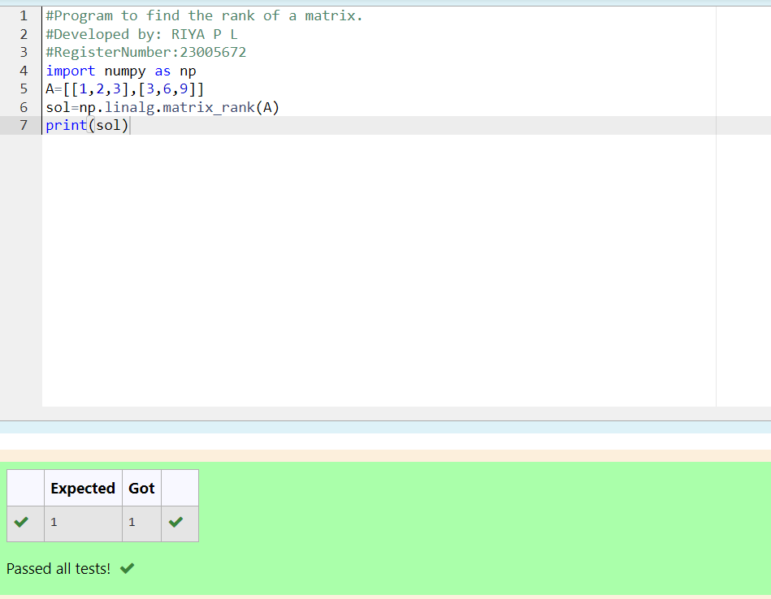

# RANK-OF-A-MATRIX
## Aim:
To write a python program to find the rank of a matrix
## Equipment’s required:
1. 	Hardware – PCs
2. 	Anaconda – Python 3.7 Installation / Moodle-Code Runner
## Algorithm:
### Step 1: 
Start with 'import numpy as np' for NumPy functionality in numerical computations.
### Step 2:
Create a 2x3 matrix A with specified elements [[1,2,3],[3,6,9]].
### Step 3: 
Using the np.linalg.matrix_rank(), we can find the rank of the given matrix.
### Step 4: 
Display the rank of A using 'print(sol)' for examination.
## Program:
```PYTHON
#Program to find the rank of a matrix.
#Developed by: RIYA P L
#RegisterNumber:23005672
import numpy as np
A=[[1,2,3],[3,6,9]]
sol=np.linalg.matrix_rank(A)
print(sol)
```
## Output:

## Result:
Thus the rank for the given matrix is successfully solved by  using a python program.

